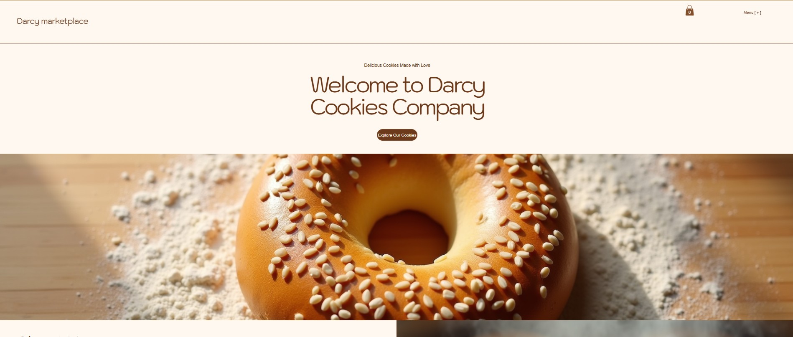
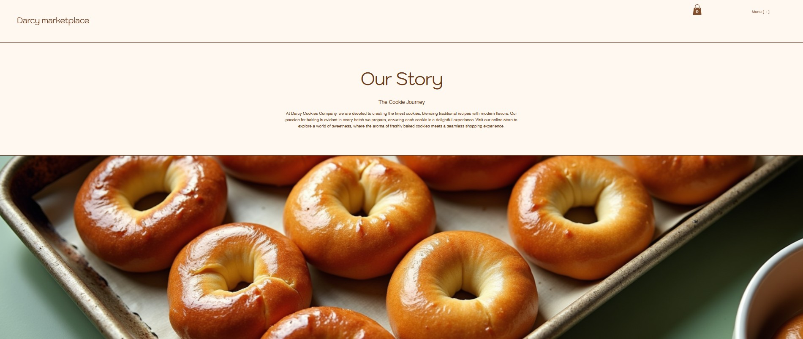
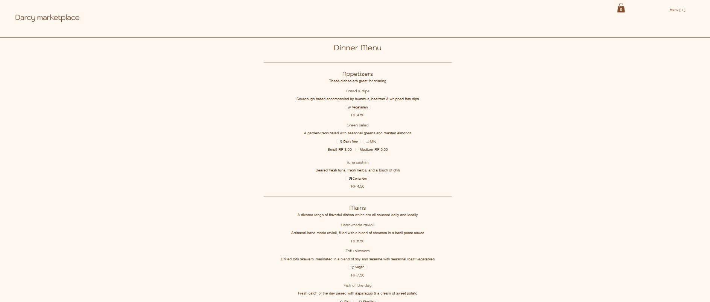
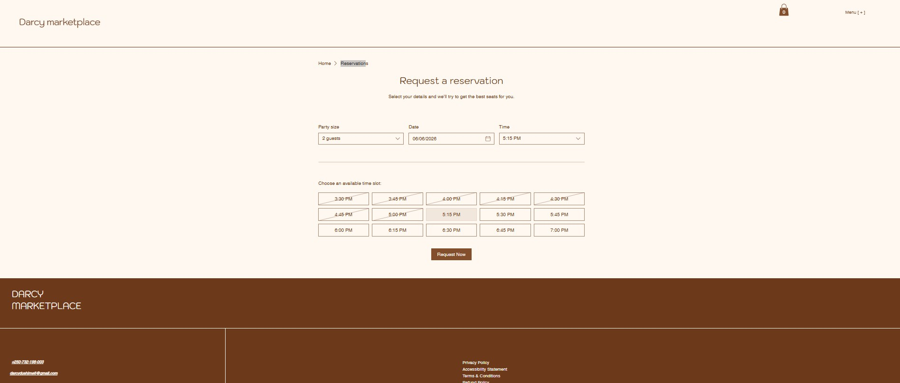
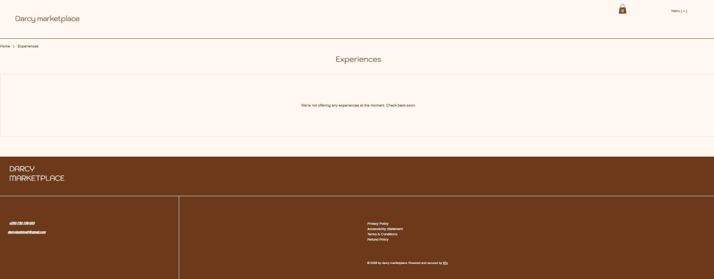
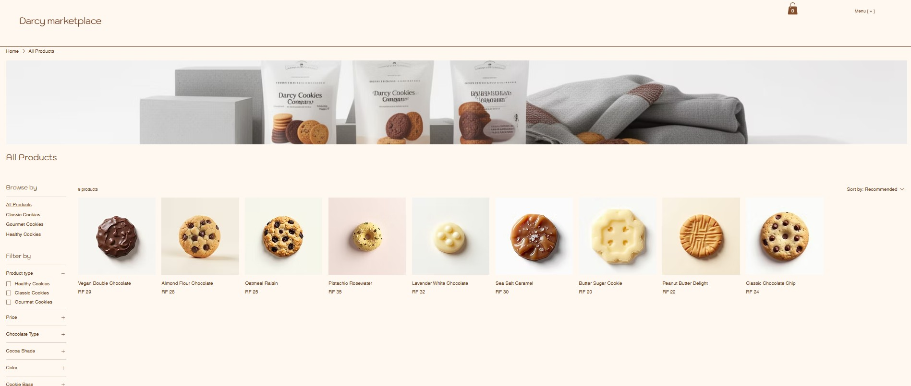
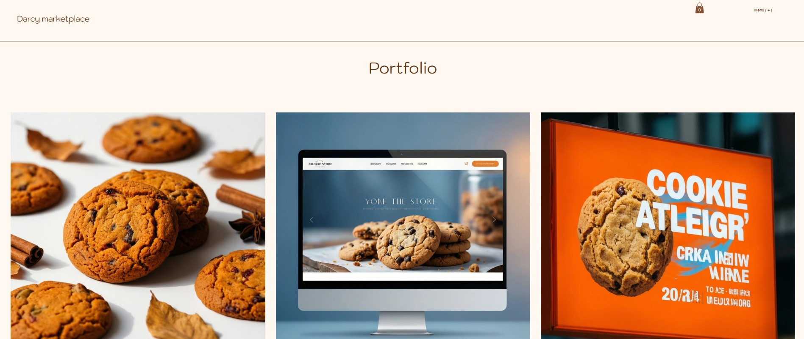

## OWNER(student information)

**RegNumber** : 24285/2024

**Name** : DUSHIME Darcy

# Darcy-Marketplace
Darcy Marketplace is an elegant online marketplace for Darcy Cookies Company, showcasing artisan baked goods, customer experiences, reservations, and online shopping. Built with Wix, it offers a responsive design, secure ordering, product galleries, and seamless customer engagement for visitors in Kigali, Rwanda.

## Link of Darcy-Marketplace

https://darcydushime6.wixsite.com/darcy-cookies-compan

## Website Pages

| Page | Description |
|------|-------------|
| **Home** | Welcome section, featured products, and latest promotions |
| **About** | Company background, mission, vision, and core values |
| **Location & Hours** | Store address, map, and opening hours |
| **Menu** | Full product and baked goods catalogue |
| **Reservations** | Online booking for in-store experiences |
| **Experiences** | Baking classes, events, and special offerings |
| **Shop** | Online store for ordering cookies and baked goods |
| **Portfolio** | Gallery of products and past work |

---

## Business Information

**DarcyCookies Company**  
Kanombe, KK 21 St  
Kicukiro District  
Kigali, Rwanda

---

## Technologies Used

- [Wix](https://www.wix.com) Website Builder
- Wix Stores
- Responsive Design

---

## Features

- Responsive layout for all devices
- Online shop with secure checkout
- Reservation and booking system
- Customer experiences and events page
- Product portfolio gallery
- Contact form integration

---

## Future Enhancements

- Customer account system
- Product reviews and ratings
- Wishlist functionality
- Live chat support
- Advanced product filtering
- Loyalty rewards program

---

# Darcy Marketplace Screenshots

## Home

## About

## Locations & Hours

## Menu

## Reservations

## Experiences

## Shop

## Portfolio

----

## License

This project is intended for educational and demonstration purposes.
